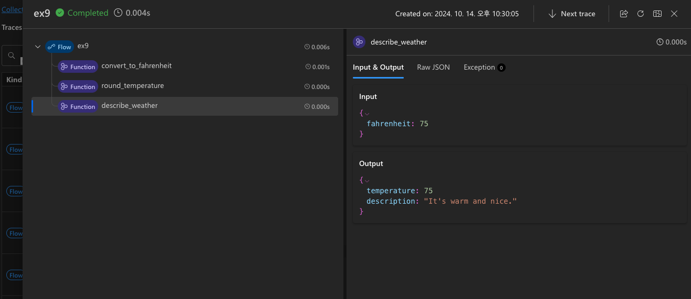

Prompt Flow를 pf 명령어가 아닌 파이썬 스크립트로 실행하는 예제입니다.

```
python3 promptflow_executor.py
```

```
Enter value for celsius_temp (string): 24
Prompt flow service has started...
2024-10-14 22:27:08 +0900    6427 execution.flow     INFO     Start executing nodes in thread pool mode.
2024-10-14 22:27:08 +0900    6427 execution.flow     INFO     Start to run 3 nodes with concurrency level 16.
2024-10-14 22:27:08 +0900    6427 execution.flow     INFO     Executing node convert_to_fahrenheit. node run id: bf73e302-6b9e-451d-98c5-1a5ab86535dc_convert_to_fahrenheit_0
2024-10-14 22:27:08 +0900    6427 execution.flow     INFO     Node convert_to_fahrenheit completes.
2024-10-14 22:27:08 +0900    6427 execution.flow     INFO     Executing node round_temperature. node run id: bf73e302-6b9e-451d-98c5-1a5ab86535dc_round_temperature_0
2024-10-14 22:27:08 +0900    6427 execution.flow     INFO     Node round_temperature completes.
2024-10-14 22:27:08 +0900    6427 execution.flow     INFO     Executing node describe_weather. node run id: bf73e302-6b9e-451d-98c5-1a5ab86535dc_describe_weather_0
2024-10-14 22:27:08 +0900    6427 execution.flow     INFO     Node describe_weather completes.
You can view the trace detail from the following URL:
http://127.0.0.1:23333/v1.0/ui/traces/?#collection=ex9&uiTraceId=0xa0ff45987f92dd4b10b18aaf127b12e3

Results:
weather_description: {'temperature': 75, 'description': "It's warm and nice."}
```


[결과] http://127.0.0.1:23333/v1.0/ui/traces/?#collection=ex9&uiTraceId=0xa0ff45987f92dd4b10b18aaf127b12e3
