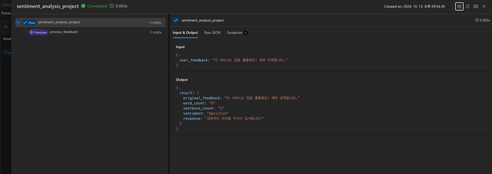
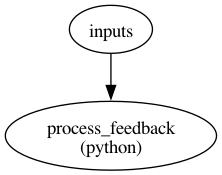

# 감정 분석 프로젝트

이 프로젝트는 Prompt Flow를 사용하여 사용자 피드백의 감정을 분석하고 적절한 응답을 생성하는 시스템을 구현합니다.

## 프로젝트 개요

이 시스템은 다음과 같은 기능을 제공합니다:
- 사용자 피드백 텍스트 분석
- 감정 분석 (긍정, 중립, 부정)
- 분석된 감정에 기반한 응답 생성

## 실행 결과

아래 이미지는 시스템의 실행 결과를 보여줍니다:



이 결과는 다음과 같은 정보를 제공합니다:
- 원본 피드백
- 단어 수
- 문장 수
- 감정 분석 결과
- 생성된 응답

## 주요 구성 요소

1. **텍스트 분석**: 입력된 피드백의 단어 수와 문장 수를 계산합니다.
2. **감정 분석**: 피드백의 감정을 긍정, 중립, 부정으로 분류합니다.
3. **응답 생성**: 분석된 감정에 따라 적절한 응답을 생성합니다.

## 사용 방법

1. Prompt Flow 환경을 설정합니다.

```
pip install promptflow promptflow-tools
```

2. `flow.dag.yaml` 파일에 정의된 플로우를 실행합니다.
3. 다음과 같은 명령어를 사용하여 사용자 피드백을 입력으로 제공합니다:

   ```bash
   cd sentiment_analysis_project
   pf flow test --flow ./flow.dag.yaml --inputs user_feedback="이 서비스는 정말 훌륭해요! 매우 만족합니다."
   ```

   이 명령어는 긍정적인 피드백을 입력으로 제공하며, 시스템은 이를 분석하고 적절한 응답을 생성합니다.

4. 여러 입력을 제공하려면 다음과 같이 명령어를 사용할 수 있습니다:

   ```bash
   pf flow test --flow ./flow.dag.yaml --inputs user_feedback="첫 번째 피드백" another_input="다른 입력 값"
   ```

   이 예시에서 `another_input`은 현재 플로우에서 사용되지 않지만, 필요에 따라 플로우를 수정하여 추가 입력을 처리할 수 있습니다.

5. 시스템이 분석 결과와 생성된 응답을 출력합니다.

## 실행 예시

긍정적인 피드백 입력 시:

```bash
pf flow test --flow ./flow.dag.yaml --inputs user_feedback="이 서비스는 정말 훌륭해요! 매우 만족합니다."
```

예상 출력:
```
{
  "original_feedback": "이 서비스는 정말 훌륭해요! 매우 만족합니다.",
  "word_count": "8",
  "sentence_count": "2",
  "sentiment": "positive",
  "response": "긍정적인 의견을 주셔서 감사합니다!"
}
```

6. 그래프를 출력합니다.

```
pip install pyyaml graphviz
```

이후 `flow_visualization.py` 스크립트를 실행하면 `flow_visualization.png`가 생성됩니다.



